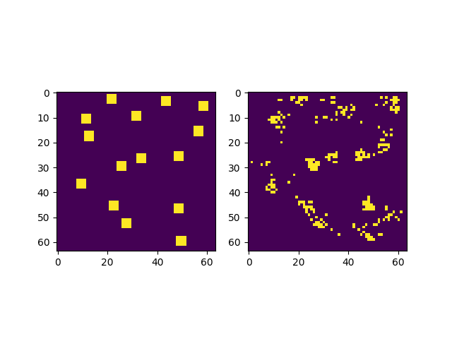

# State Encoding with Relation Networks

This repo contains implementations of Relation Networks (RN) [[1]](#references) and a Convolutional 
Variational AutoEncoder (VAE).  I am messing around with a simple toy dataset, where I 
randomly sample a variable number of cubes on a 64x64 grid, and I try to 
learn an AutoEncoder for the positions of the cubes.

For the VAE, the architecture and setup are straightforward; 
I feed in images, embed them, and then try to reconstruct them.
In the RN, however, I am exploring using just the raw state of the system.
Instead of taking images, I feed the RN raw state information as a 
set of XY coordinates for the centers of the cubes, and it forms
an embedding of these. And instead of decoding this embedding to an image, 
I decode it to parameterize the weights, means, and covariances of a Mixture Density Network (MDN), which forms a probability density over the location of
the objects in XY space.
So it is kind of autoencoding, but a little bit weird and different because
there are a variable number of objects to deal with, rather than
just a single image to encode and decode.
I train this by minimizing the negative log probabilities of the MDN
distribution for each of the objects in the set (i.e., doing maximum 
likelihood estimation on the input data, see [[2]](#references)).  See the
results below for this to make more sense.

I am also experimenting with mixtures of the two approaches: encoding the state 
with the RN and decoding it with a VAE decoder, and predicting the MDN
output from the VAE latent space, and also combining image activations
and state inside the RN to see if that helps.
These mixtures are currently inefficient based on how I have implemented the
RNs in TensorFlow, so I plan to work on that next.  (Right now the RN
raw state version runs more quickly on CPU (quite fast), while the VAE runs 
more quickly on GPU).

## Training

These commands will start training the network.  Intermediary results are 
logged to TensorBoard and plots are saved in the `logs/` folder by default.

```
python3 main.py --mode=rn

# or

python3 main.py --mode=vae
```


## Results

I train both approaches on the same dataset distribution, but the RN sees the 
cube XY coords, while the VAE sees rendered 64x64 rendered images of these.
I run them for 50k iterations with a minibatch size of 32 and I plot
the results of the later examples (cherry-picking a few interesting /
illustrative samples).  Right now I am just kind of messing around,
so I think results could be further improved.

### Data generation
For these tests, I ran with a fixed number of 15 cubes with radius 3
in a 64x64 grid.  There are 3 functions that I uniformly sample from to generate the data.  For each of these, I throw out samples that are outside the grid
or overlap with other samples.  They are:
- Sample uniformly throughout the grid
- Sample a single point and grow outward
- Sample two points and grow outward from either cluster (with 50/50 chance)

### VAE

For the VAE, I plot the input and output images side-by-side.

 



### RN

For the RN, I use a contour plot to represent the probability distribution 
that the MDN predicts given the raw state input data, which are shown as dots 
in the figure.

 


Both methods are better at handling the clustered sampling than they are
at handling the uniform random sampling.
It is a bit hard to compare them, since they are producing different output
modalities, but I think the VAE results pretty a bit nicer right now.
Maybe the balance is tipped a bit in its favor;  I use a small 64x64 image 
size with simple shapes, and the implementation is mostly borrowed from other 
tuned examples, whereas I have not tried tuning the RN much or experimented u
with other output or loss approaches, yet. 

Next I think it would be interesting to compare mixes of encoding and decoding 
with raw state and image info.


### Art 

The VAE also generates some cool images as it is training.  


Texas <br>


Map <br>


Tank <br>


## References

[1] Adam Santoro\*, David Raposo\*, David G.T. Barrett, Mateusz Malinowski, Razvan Pascanu, Peter Battaglia, Timothy Lillicrap. A simple neural network module for relational reasoning. https://arxiv.org/abs/1706.01427 


[2] Section 6.2.1.1. https://www.deeplearningbook.org/contents/mlp.html

